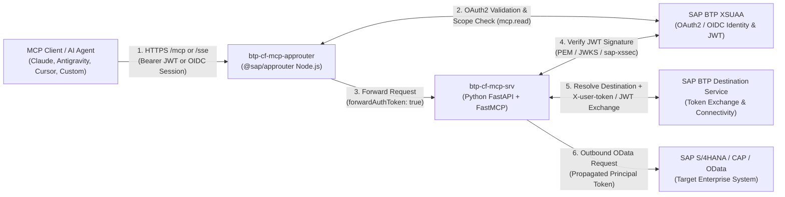
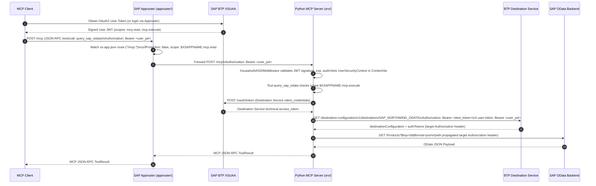

# SAP BTP Cloud Foundry Python MCP Server — Architecture

## 1. Component Topology on SAP BTP Cloud Foundry

```mermaid
flowchart LR
    Client["MCP Client / AI Agent\n(Claude, Antigravity, Cursor, Custom)"]
    Approuter["btp-cf-mcp-approuter\n(@sap/approuter Node.js)"]
    XSUAA["SAP BTP XSUAA\n(OAuth2 / OIDC Identity & JWT)"]
    MCPServer["btp-cf-mcp-srv\n(Python FastAPI + FastMCP)"]
    DestSvc["SAP BTP Destination Service\n(Token Exchange & Connectivity)"]
    SAPBackend["SAP S/4HANA / CAP / OData\n(Target Enterprise System)"]

    Client -->|"1. HTTPS /mcp or /sse\n(Bearer JWT or OIDC Session)"| Approuter
    Approuter <-->|"2. OAuth2 Validation &\nScope Check (mcp.read)"| XSUAA
    Approuter -->|"3. Forward Request\n(forwardAuthToken: true)"| MCPServer
    MCPServer <-->|"4. Verify JWT Signature\n(PEM / JWKS / sap-xssec)"| XSUAA
    MCPServer <-->|"5. Resolve Destination +\nX-user-token / JWT Exchange"| DestSvc
    MCPServer -->|"6. Outbound OData Request\n(Propagated Principal Token)"| SAPBackend
```

---

## 2. End-to-End Principal Propagation Sequence

```mermaid
sequenceDiagram
    autonumber
    participant Agent as MCP Client
    participant AR as SAP Approuter (approuter/)
    participant XSUAA as SAP BTP XSUAA
    participant PyMCP as Python MCP Server (srv/)
    participant Dest as BTP Destination Service
    participant S4 as SAP OData Backend

    Agent->>XSUAA: Obtain OAuth2 User Token (or login via Approuter)
    XSUAA-->>Agent: Signed User JWT (scopes: mcp.read, mcp.execute)
    Agent->>AR: POST /mcp (JSON-RPC tools/call: query_sap_odata)\nAuthorization: Bearer <user_jwt>
    AR->>AR: Match xs-app.json route (^/mcp.*)\ncsrfProtection: false, scope: $XSAPPNAME.mcp.read
    AR->>PyMCP: Forward POST /mcp\nAuthorization: Bearer <user_jwt>
    PyMCP->>PyMCP: XsuaaAuthASGIMiddleware validates JWT signature, exp, aud\nSets UserSecurityContext in ContextVar
    PyMCP->>PyMCP: Tool query_sap_odata checks scope $XSAPPNAME.mcp.execute
    PyMCP->>XSUAA: POST /oauth/token (Destination Service client_credentials)
    XSUAA-->>PyMCP: Destination Service technical access_token
    PyMCP->>Dest: GET /destination-configuration/v1/destinations/SAP_NORTHWIND_ODATA\nAuthorization: Bearer <dest_token>\nX-user-token: Bearer <user_jwt>
    Dest-->>PyMCP: destinationConfiguration + authTokens (target Authorization header)
    PyMCP->>S4: GET /Products?$top=5&$format=json\n(with propagated target Authorization header)
    S4-->>PyMCP: OData JSON Payload
    PyMCP-->>AR: MCP JSON-RPC ToolResult
    AR-->>Agent: MCP JSON-RPC ToolResult
```
